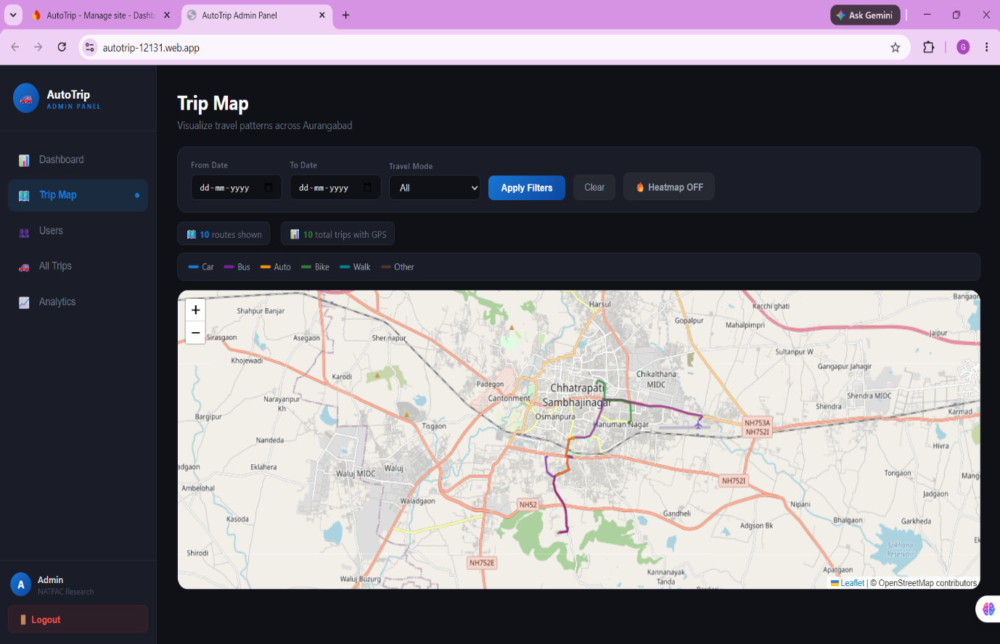
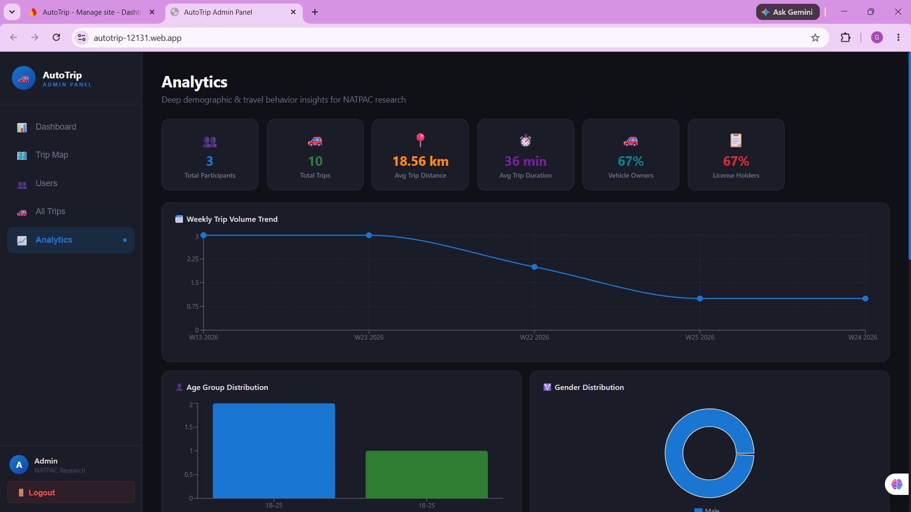
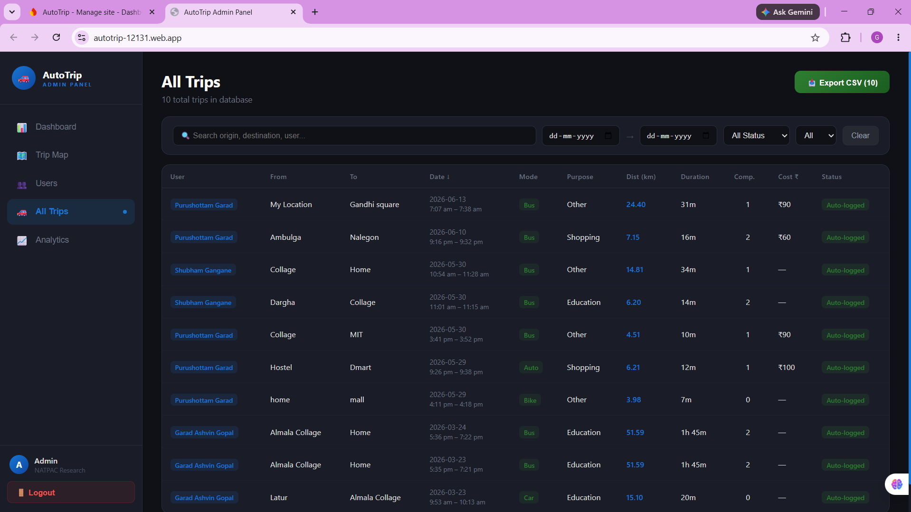
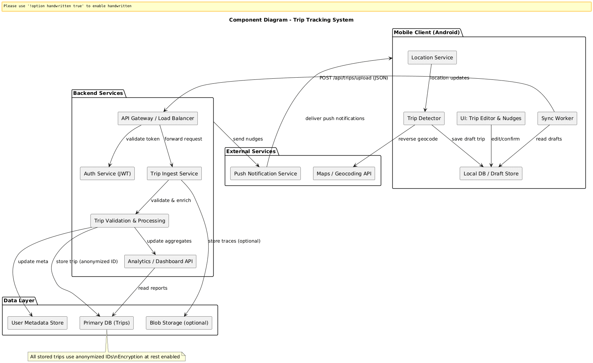

# 📍 AutoTrip — Your Trip Story, Auto-Written

An automated, smartphone-based travel behaviour data collection system developed for transportation research in collaboration with **NATPAC** (*National Transportation Planning and Research Centre*). 

AutoTrip replaces expensive, error-prone manual household travel diaries with passive, high-precision GPS tracking and a streamlined **Sense-Confirm-Sync** pipeline.

----------------------------------------------------------------------------------------------------------------------------------------------

## 📌 Features & Highlights

- **Passive GPS Foreground Tracking:** Captures real-time trip paths, origin/destination coordinates, timestamps, and route breadcrumbs using Android's `FusedLocationProviderClient` with a persistent foreground service.
- **Accurate Distance & Metric Computation:** Calculates incremental and total journey distances using the **Haversine formula**.
- **Sense-Confirm-Sync Workflow:** Automatically logs journeys and prompts users through a lightweight confirmation interface to fill in key details (*travel mode, purpose, companion count, and travel cost*).
- **Tailored for Regional / Indian Transit Modes:** Full support for local transportation options, including **Auto-Rickshaw**, **Two-Wheeler**, **Bus**, **Car**, **Walk**, and **Bicycle**.
- **NATPAC Profile & Demographics Module:** 3-tab profile capturing demographic data, household vehicle ownership, primary commute habits, and residence types.
- **Granular Privacy & Permission Controls:** In-app toggles for anonymous data sharing, background detection, and location permissions.
- **Real-Time Data Sync:** Instant UI state synchronisation and cloud storage powered by **Firebase Firestore Snapshot Listeners**.
- **Built-in Developer GPS Simulator:** Road-following GPS trip simulation running at 10x real-world speed via the **OSRM (Open Source Routing Machine) API** to test without physical movement.
- **Research & Admin Dashboard:** Web portal displaying trip maps, aggregated analytics, modal shares, and data export features for planners.

----------------------------------------------------------------------------------------------------------------------------------------------

## 🛠️ Architecture & Tech Stack

### **Android Application (Client)**
- **Language:** Kotlin `2.0.21`
- **UI Toolkit:** Jetpack Compose with Material Design 3
- **Architecture:** MVVM (Model-View-ViewModel) + Repository Pattern + Kotlin Coroutines & StateFlow
- **Location API:** Google Play Services `FusedLocationProviderClient` (3s interval, 5m displacement threshold)
- **Map & Routing:** OSMDroid `6.1.20` & OSRM API
- **Target Platform:** Android (Min SDK: `API 31 / Android 12`, Target SDK: `API 36`)
- **Build System:** Gradle `8.13` with Kotlin DSL

### **Backend & Cloud Infrastructure**
- **Authentication:** Firebase Authentication (Email/Password)
- **Database:** Google Cloud Firestore (NoSQL hierarchical structure)
- **Data Model:** `users/{uid}` and `users/{uid}/trips/{tripId}`

----------------------------------------------------------------------------------------------------------------------------------------------

## 📂 Project Structure

```text
Auto_Trip/
├── app/
│   ├── src/
│   │   ├── main/
│   │   │   ├── java/com/.../autotrip/
│   │   │   │   ├── data/
│   │   │   │   │   ├── model/          # User & Trip data classes
│   │   │   │   │   └── repository/     # Firebase & Location repositories
│   │   │   │   ├── service/            # TrackingService (Foreground GPS Service)
│   │   │   │   ├── ui/
│   │   │   │   │   ├── auth/           # Login & Registration screens
│   │   │   │   │   ├── tracking/       # Map picker & active tracking
│   │   │   │   │   ├── tripdetails/    # Trip confirmation & edit sheets
│   │   │   │   │   ├── mytrips/        # Weekly calendar & past trips
│   │   │   │   │   ├── profile/        # 3-Tab Profile & Privacy settings
│   │   │   │   │   └── devtools/       # OSRM GPS Simulation screen
│   │   │   │   └── viewmodel/          # StateFlow-driven ViewModels
│   │   │   └── AndroidManifest.xml
│   │   └── res/
│   └── build.gradle.kts
├── gradle/
└── README.md
```

# 🚀 Want to run it yourself?

Follow these steps to set up, build, and run the AutoTrip Android application on your local machine.

## 📋 Prerequisites
Before you begin,ensure you have the following installed:
- Android Studio Ladybug (or later)  
- JDK 17+ (configured in your IDE)
- Git installed on your system
- An Android physical device or emulator running Android 12 (API level 31) or higher  
- A Google Firebase account

## 🛠️ Step-by-Step Setup Instructions
### 1. Clone the Repository
Open your terminal or command prompt and clone this repository:
```
git clone [https://github.com/itspuru21/Auto_Trip.git](https://github.com/itspuru21/Auto_Trip.git)
cd Auto_Trip
```

### 2. Set Up Firebase Configuration
AutoTrip relies on Firebase Authentication and Cloud Firestore.

- Go to the Firebase Console and create a new project.
- Register an Android app using your package name.
- Enable Email/Password under Authentication > Sign-in method.
- Enable Cloud Firestore and configure database security rules for user subcollections (users/{uid}).
- Download your generated google-services.json file.
- Place google-services.json into your local app/ directory:
```
Auto_Trip/
└── app/
    └── google-services.json
```
### 3. Open and Sync the Project in Android Studio
- Launch Android Studio.
- Select Open and choose the cloned `Auto_Trip` directory.
- Allow Gradle to sync all dependencies and build configurations (`Gradle 8.13, Kotlin 2.0.21`, Jetpack Compose libraries).

### 4. Build and Run the Application
- Connect a physical Android device via USB (with USB Debugging enabled) or launch an Android Emulator (`API level 31+`).
- Click the green Run (`▶`) button in Android Studio, or execute via terminal:
```
# Build Debug APK
./gradlew assembleDebug

# Install directly to connected device
./gradlew installDebug
```

### 5. Test Live Tracking vs. GPS Simulation
You can test the application in two ways:
- Real Movement Tracking:
    - Launch the app and grant the required Location & Notification permissions.  
    - Tap New Trip $\rightarrow$ select your destination on the OSM map $\rightarrow$ tap Start Tracking.
    - Move around to see real-time distance accumulation and speed metrics via the persistent foreground service.
- Developer GPS Simulator (No physical movement needed):
    - Ensure you are running the `debug` build.
    - Go to Profile ➔ Settings ➔ Developer Tools.
    - Tap the map to drop a Start Pin (Green) and an End Pin (Red).
    - Choose a vehicle mode (Car, Bus, Auto-Rickshaw, Bike, etc.) and tap Start Simulation.
    - The app will fetch real road coordinates from the OSRM API and simulate the journey at 10x speed while writing real-world duration and distance data to Firestore.

----------------------------------------------------------------------------------------------------------------------------------------------

# 📊 Comparison with Existing Survey Systems


| Parameter | Traditional Manual Survey | MoveSmarter (Europe) | AutoTrip (Proposed) |
| :--- | :--- | :--- | :--- |
| **Trip Detection** | Manual recall by respondent PDF | Automatic GPS + Sensor fusion PDF | Automatic GPS via Foreground Service PDF |
| **Data Accuracy** | Low (High recall bias) PDF | High PDF | High (GPS + Prompted user confirmation) PDF |
| **Route Capture** | Not captured | Full GPS polyline | Full GPS breadcrumb trail + Map replay |
| **Indian Transit Modes** | Covered manually | Not covered | Auto, Two-Wheeler, Bus, Car, Walk, Bike |
| **NATPAC Research Fields** | Custom paper forms | Partial / Generic only | Fully covered (Cost, Companions, Residence) |
| **Real-Time Cloud Sync** | No (Periodic manual entry) | Periodic batch sync | Real-time Firestore snapshot streams |
| **Testing Utility** | N/A | No simulator | Built-in OSRM 10x Road Simulator |

# 🔒 Privacy & Data Handling
- Fine-Grained Permissions: Toggle anonymous research sharing with NATPAC or background auto-detection directly from the Settings tab[cite: 1].
- Data Isolation: User trip subcollections are secured under users/{uid}/trips[cite: 1].
- Account Deletion: Permanent account erasure wipes both Firestore profile records and Firebase Auth credentials[cite: 1].

## 📱 Application Screenshots

| Onboarding & Auth | Active GPS Tracking | Trip Summary & Edit |
| :---: | :---: | :---: |
|  |  |  |

| User Profile & NATPAC Fields | Weekly Trip History | Developer GPS Simulator |
| :---: | :---: | :---: |
|  |  |  |

---

## 🖥️ Research & Admin Dashboard

The web dashboard enables NATPAC transportation planners to visualize aggregated spatial mobility patterns, inspect real-time modal shares, and export filtered datasets.

| Spatial Trip Map | Modal Share & Analytics | Filterable Data Grid |
| :---: | :---: | :---: |
|  |  |  |

## 🏗️ System Architecture & Workflow
### Sense-Confirm-Sync Pipeline

[Android Client]                     [Firebase Cloud]              [NATPAC Portal]
TrackingService (Foreground GPS) ──> Firestore Database ──────────> Web Analytics
│                                  │
▼                                  ▼
Prompted Recall Notification        users/{uid}/trips
(Mode, Purpose, Companions, Cost)

### Architecture & Data Flow Diagrams
- **System Architecture:** Detailed client-server structure running on Android and Google Cloud Firestore.
- **Component & Deployment Diagrams:**
  <p align="center">
    
  </p>

## 📄 Sample Trip Output (Firestore Document)

Each validated journey is stored under the path `users/{uid}/trips/{tripId}` with the following schema:

```json
{
  "tripId": "TRIP_2026_0530_001",
  "userId": "firebase_auth_uid_12345",
  "date": "2026-05-30",
  "startTime": "10:00 AM",
  "endTime": "10:34 AM",
  "durationSecs": 2040,
  "distanceKm": 14.8,
  "origin": "College",
  "destination": "Home",
  "travelMode": "Bus",
  "purpose": "Education / Commute",
  "companions": 1,
  "cost": 30.0,
  "status": "Auto-logged",
  "routePoints": [
    "8.5241,76.9366",
    "8.5255,76.9380",
    "8.5301,76.9421"
  ]
}
```

# 👥 Authors & Academic Attribution
- Project: AutoTrip — Travel Behaviour Data Collection System[cite: 1]
- Collaborator / Research Partner: NATPAC (National Transportation Planning and Research Centre)[cite: 1]
- Department: Department of Computer Science and Engineering[cite: 1]

# 📄 License
***Distributed under the MIT License (or institutional research license where applicable).***
